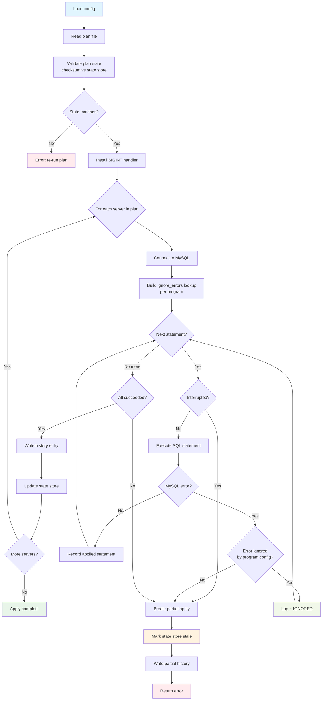
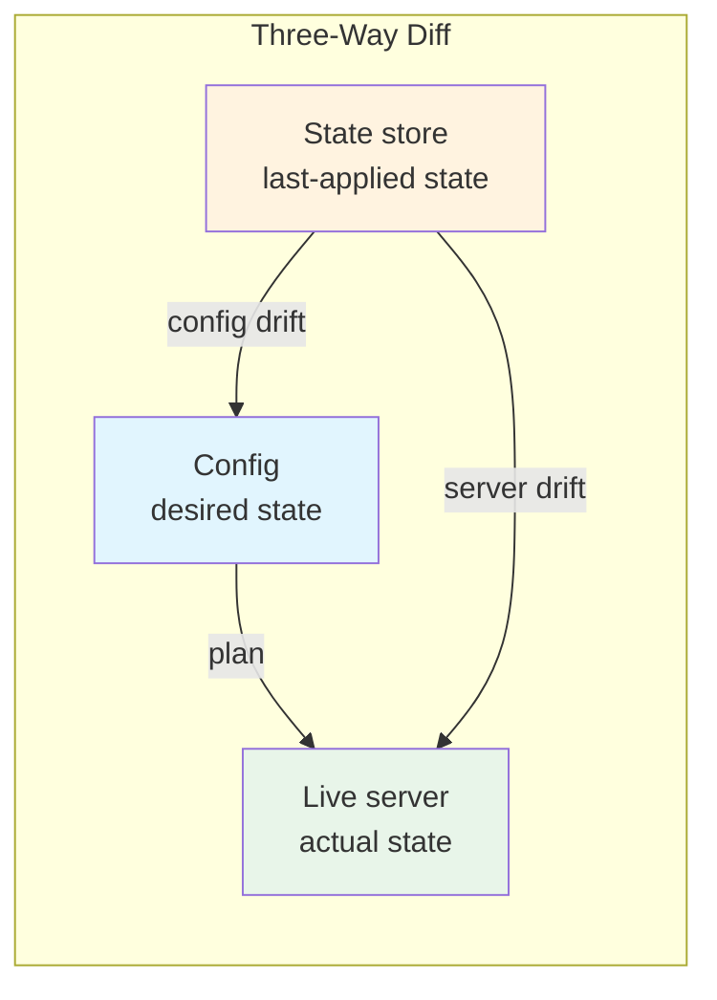

# Overview

High-level process flows for the `plan` and `apply` commands.

## Plan

```mermaid
flowchart TD
    A[Load &amp; merge config] --> B[Filter programs]
    B --> C[Validate program–server references]
    C --> D[Collect server names for environment]
    D --> E{For each enabled server}

    E --> F[Connect to MySQL]
    F --> G[Read actual state<br/>roles &amp; SHOW GRANTS]
    G --> H[Query database list<br/>information_schema.SCHEMATA]
    H --> I[Expand role templates<br/>replace &#123;&#123;name&#125;&#125; per program]
    I --> J[Build desired state<br/>resolve permission sets per scope]
    J --> K[Expand database patterns<br/>e.g. zban_qa pattern to concrete DBs]
    K --> L[Diff desired vs actual<br/>produce migration statements]
    L --> M{More servers?}
    M -- Yes --> E
    M -- No --> N[Attach state checksums<br/>for stale-plan detection]

    N --> O[Write plan file JSON]

    style A fill:#e1f5fe
    style O fill:#e8f5e9
    style L fill:#fff3e0
```

Servers are planned **concurrently**; results are sorted deterministically by server name before writing the plan file.

## Apply

Servers are applied **sequentially** (order matters for state consistency). On error or interrupt, the state is marked stale — this changes the state checksum, which forces a re-plan before the next apply attempt.

### Interrupt Handling

| Signal | Behavior |
|--------|----------|
| 1st Ctrl+C | Sets interrupted flag; current statement finishes, then partial apply is saved |
| 2nd Ctrl+C | Immediate `os.Exit(130)`; state and history may be incomplete |

## Drift Detection

| Diff | From | To | Command |
|------|------|----|---------|
| Migration | Actual state | Desired state | `plan` |
| Config drift | Last-applied state | Desired state | `show --drift` |
| Server drift | Last-applied state | Actual state | `show --drift` |
